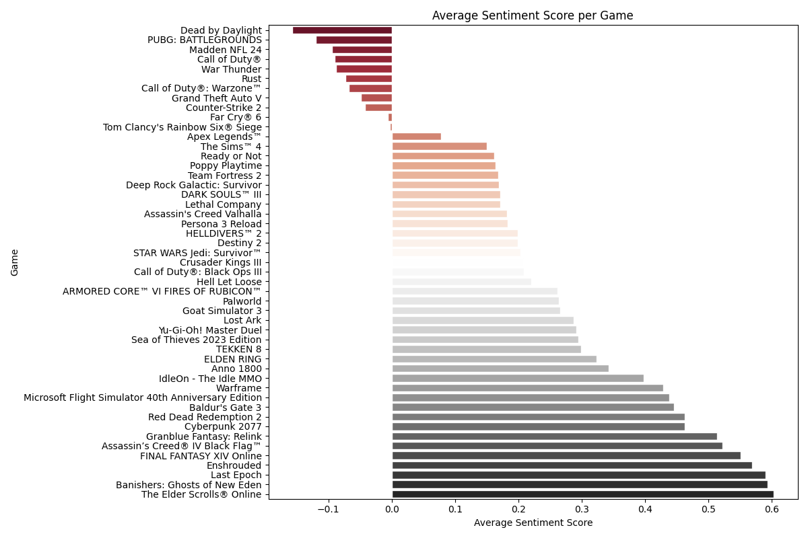

**Overview**

The Steam Sentiment Analysis project is a tool designed to analyze user reviews on Steam, the popular gaming platform. Unlike Steam's existing algorithm, which simply categorizes reviews as positive or negative based on overall ratings, this project delves deeper. It examines individual reviews to determine the sentiment expressed by players toward each game.
The goal of this project is to provide a more nuanced understanding of player sentiment, going beyond the simplistic positive/negative classification used by Steam. By analyzing the content of each review, it offers insights into what players truly think about a game. This approach allows for a more comprehensive assessment of user sentiment, enhancing the accuracy of evaluations compared to Steam's current algorithm.

Here's an example visual from Kmeans analysis!

**Toolset:**
- Flask
- Python 
- NLTK
- Scikit-Learn
- Gensim
- Pandas
- Transformers
- Feather/CSV Files
- Git and GitHub

**Data Collection & Preprocessing**

I have developed scripts to efficiently scrape Steam reviews for various games. The collected data undergoes a thorough preprocessing stage where I tokenize and lemmatize the review text. This process is crucial for cleaning and preparing the data, making it suitable for the subsequent analysis. By breaking down the text into its base forms, I can ensure that the analysis is based on the core content of the reviews, removing any noise that could skew the results.

**Machine Learning Models**

In my project, I employ unsupervised learning models to cluster the reviews, aiming to uncover common themes and sentiments expressed by gamers. I've chosen a mix of models to address different aspects of the analysis: K-Means clustering serves as the foundation for general grouping of reviews, Hierarchical clustering is used to delve into the nuanced relationships between different sentiments, and LDA (Latent Dirichlet Allocation) is utilized for sophisticated topic modeling. This multifaceted approach allows me to capture a wide array of insights from the review data.

**Analysis & Visualization**

To visually represent the findings, I will create word clouds that highlight the most frequent terms within each cluster (per game as well), offering an immediate sense of the predominant themes. Additionally, I will use box-whisker and violin charts to present a comparative view of sentiments across different clusters, finding a clear distribution, and enabling a clear visualization of each games emotional landscape. (True Sentiment Per Game)

***Current Visuals:***
- Wordclouds for each cluster, users must know the overarching sentiment behind the clusters per game! What is determining the sentiment of these clusters? Lets look!
- Sentiment distribution across clusters using box and whisker plots and a violin plot. How varied are the clusters, are they accurate in determining the true view of the game?
- An average sentiment score per game, bar graph form. The K-means clustering model assigns sentiment scores to each review, and then, by aggregating these scores for each game and calculating the average, you obtain a single sentiment score representative of the overall sentiment for that game. This approach allows you to summarize the sentiment of each game based on the sentiments expressed in its reviews.
- Distribution of the sentiment scores, how frequently do these scores occur? Can we ensure the reviews vary in their sentiment (determined by the positive/negative words in the review), as they should! There should be a decent amount of varience across the scores, and less varied for games that players LOVED vs HATED!

**Current Models:**

***K-Means Clustering***
- Description: A method that groups reviews into a specified number of clusters based on the similarity of their content. Clustering all reviews for each game into a few clusters (e.g., positive, negative, neutral), the algorithm likely aimed to capture the overall sentiment expressed by players toward each game.
- Application to Steam Reviews: K-Means can categorize reviews into distinct groups based on their text. Each cluster might represent reviews focusing on similar aspects of games, like graphics, gameplay, or customer service. However, it won't explicitly label these groups as positive or negative.
- The kmeans script is creating clusters for every game in the CSV, not for every review (overall clusters) It then performs clustering on the reviews for each game separately, so each cluster contains reviews that are related to a specific game. This approach allows for analyzing and understanding sentiment patterns within the reviews of individual games, rather than across all reviews indiscriminately.

**IN PROGRESS:**
  
***Hierarchical Clustering***
- Description: Builds a tree-like structure of clusters, showing how each review is grouped at various levels of similarity.
- Application to Steam Reviews: This method allows you to see not just which reviews are similar, but also how they relate to each other in a multi-level hierarchy. It can reveal nuanced relationships between different reviews, such as grouping together all reviews that discuss a specific game feature, then further subdividing them based on sentiment or specific aspects of that feature.

***Latent Dirichlet Allocation (LDA) for Topic Modeling***
- Description: An advanced technique that discovers latent topics within the text data. Each review can contribute to multiple topics to varying degrees.
- Application to Steam Reviews: LDA can identify underlying themes or topics across your reviews. For instance, it might reveal common subjects like game difficulty, story depth, or technical issues. This method helps in understanding the predominant topics of discussion in the reviews, although it doesn’t classify sentiment directly.

**Flask Web Application**
To make the insights derived from my analysis accessible and understandable, I am developing a Flask web application. This web app will serve HTML pages that display the results of the sentiment analysis and clustering in an interactive and user-friendly manner. By presenting the data through a web interface, I aim to provide both gamers and game developers with valuable insights into the gaming community's feedback, potentially guiding future game development and enhancing the gaming experience.
