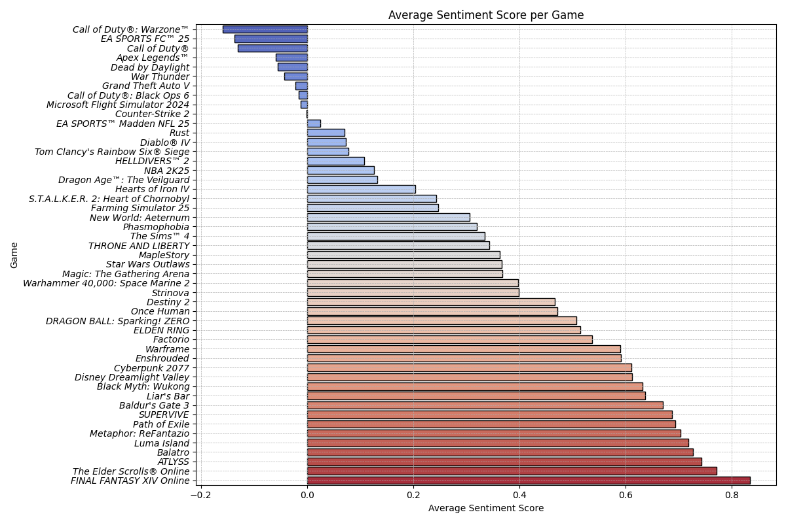

# Overview

The Steam Sentiment Analysis project is a tool designed to analyze user reviews on Steam, the popular gaming platform. Unlike Steam's existing algorithm, which simply categorizes reviews as positive or negative based on overall ratings, this project delves deeper. It examines individual reviews to determine the sentiment expressed by players toward each game.
The goal of this project is to provide a more nuanced understanding of player sentiment, going beyond the simplistic positive/negative classification used by Steam. By analyzing the content of each review, it offers insights into what players truly think about a game. This approach allows for a more comprehensive assessment of user sentiment, enhancing the accuracy of evaluations compared to Steam's current algorithm.
- There is a guide on how to run this project provided - Steam_SentimentAnalysis/mynotes
/howtorun.md
- If you'd like to contribute just pull request and/or message me via weinbren@msu.edu.

### Preview of K-Means Analysis Results:

| Sentiment Among Best Sellers | 
|----------|
|  | 

| BG3 Sentiment - 3 Clusters |
|----------|
|  | 

**Baldurs Gate 3 Analysis:**
- Steams BG3 Score: Overwhelmingly Positive 96% of the 505,051 user reviews for this game are positive.
- Three Clusters Analysis: While a significant number of reviews fall in the positive range (Cluster 1 and Cluster 2), some negative sentiment exists (Cluster 0). (Violin/Boxplot)
- The distribution has a clear positive skew, meaning the game is generally well-received, with a minority expressing dissatisfaction. (Histogram)
- Most reviews have positive sentiment scores, clustering around 0.5 to 1.0.
There’s a noticeable but smaller number of negative reviews, with scores closer to -0.5 or lower. (Bar/Histogram)

# Data Collection & Preprocessing

I have developed scripts to efficiently scrape Steam reviews for various games. The collected data undergoes a thorough preprocessing stage where I tokenize and lemmatize the review text. This process is crucial for cleaning and preparing the data, making it suitable for the subsequent analysis. By breaking down the text into its base forms, I can ensure that the analysis is based on the core content of the reviews, removing any noise that could skew the results.

Added in advanced tokenizing so the processing handles word Emphasis Detection,  Handling for Slang and Abbreviations, and Negation Handling.

# Machine Learning Models

In my project, I employ unsupervised learning models to cluster the reviews, aiming to uncover common themes and sentiments expressed by gamers. I've chosen a mix of models to address different aspects of the analysis: K-Means clustering serves as the foundation for general grouping of reviews, Hierarchical clustering is used to delve into the nuanced relationships between different sentiments, and LDA (Latent Dirichlet Allocation) is utilized for sophisticated topic modeling. This multifaceted approach allows me to capture a wide array of insights from the review data.

# Current Models:

## K-Means Clustering
- Description: A method that groups reviews into a specified number of clusters based on the similarity of their content. Clustering all reviews for each game into a few clusters (e.g., positive, negative, neutral), the algorithm aims to capture the overall sentiment expressed by players toward each game.
- The kmeans script is creating clusters for every game in the CSV, not for every review (overall clusters) It then performs clustering on the reviews for each game, so each cluster contains reviews that are related to that specific game. This approach allows for analyzing and understanding sentiment patterns within the reviews of individual games, rather than across all reviews indiscriminately.

***K-means Fine Tuning - Feature Engineering***
- Revised code with silhouette score and Davies-Bouldin index evaluations for cluster evaluation. Want to ensure clusters have overarching theme, solid distribution.
- Used highest TF-IDF scores from vectorizer to determine which words were making the most impact on the cluster themes. Added common gaming terminology to the lexicon so that it could more precisely determine the sentiment of the reviews.
- Used silhouette method to help determine the amount of clusters to choose for kmeans.

## Hierarchical Clustering
- Description: Builds a tree-like structure of clusters, showing how each review is grouped at various levels of similarity per game.
- Hierarchical Clustering builds a tree of clusters without requiring the number of clusters to be specified beforehand. 
- It's more informative for understanding the data structure and can reveal how clusters are related at different levels of granularity.
- Application to Steam Reviews: This method allows you to see not just which reviews are similar, but also how they relate to each other in a multi-level hierarchy. It can reveal nuanced relationships between different reviews, such as grouping together all reviews that discuss a specific game feature, then further subdividing them based on sentiment or specific aspects of that feature.

# Analysis & Visualization
- Sentiment distribution across clusters using box and whisker plots and a violin plot. How varied are the clusters, are they accurate in determining the true view of the game?
- An average sentiment score per game, bar graph form. The K-means clustering model assigns sentiment scores to each review, and then, by aggregating these scores for each game and calculating the average, you obtain a single sentiment score representative of the overall sentiment for that game. This approach allows you to summarize the sentiment of each game based on the sentiments expressed in its reviews.
- Distribution of the sentiment scores, how frequently do these scores occur for each game? Can we ensure the reviews vary in their sentiment (determined by the positive/negative words in the review), as they should! There should be a decent amount of varience across the scores, and less varied for games that players LOVED vs HATED!

# In Progress:

- For all changes, additions, and updates - check the mynotes folder and the log to see what EXACTLY was changed, when, and why!

***Latent Dirichlet Allocation (LDA) for Topic Modeling***
- Description: An advanced technique that discovers latent topics within the text data. Each review can contribute to multiple topics to varying degrees.
- Topic modeling is great for extracting hidden themes, but it doesn’t directly provide sentiment.
- Application to Steam Reviews: LDA can identify underlying themes or topics across your reviews. For instance, it might reveal common subjects like game difficulty, story depth, or technical issues. This method helps in understanding the predominant topics of discussion in the reviews, although it doesn’t classify sentiment directly.

***Flask Web Application***
- To make the insights derived from my analysis accessible and understandable, I am developing a Flask web application. This web app will serve HTML pages that display the results of the sentiment analysis and clustering in an interactive and user-friendly manner. By presenting the data through a web interface, I aim to provide both gamers and game developers with valuable insights into the gaming community's feedback, potentially guiding future game development and enhancing the gaming experience.
